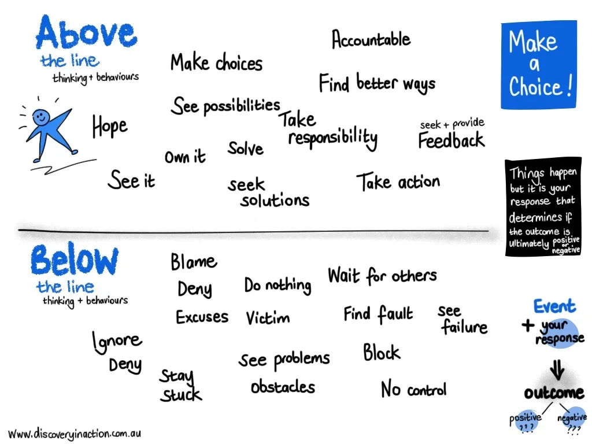

**Book Author:** Urban Meyer

Every day & in every situation is an internal battle for how we live our lives: Above OR Below the Line. It's not what happens that matters, instead it's the response that we CHOOSE.

**Key Takeaways:**

Getting & staying Above the Line is the foundation for success in anything that you do. It does not come naturally. It must be taught & learned.

Event + Response = Outcome

Success is cumulative & progressive. It is the result of what you do everyday. Both successful & unsuccessful people take daily action, the difference is that successful people take action Above the Line. They step up & act with INTENTION; PURPOSE; & SKILL.

Remove BCD (Blame; Complain; & Defend).

Under pressure, we do not rise to the occasion. We rise or fall to the level of our training.

Time is a nonrenewable resource. If you waste it, you never get it back, so it's essential to pick your battles wisely.

If your habits are not in alignment with your dreams you can either lower your dreams or elevate your habits.

A leader is someone who inspires & empowers people to get to places that they wouldn't be able to reach otherwise & also to help them lead better lives.

Be open to new ideas. Live; Listen; & Learn. You can't learn what you THINK already know - The day that you THINK you know it all is the day you start falling behind.

Leaders need to set an example. You can't lead people to a place that you're not going to as well. If it isn't happening in you, it won't happen through you.

